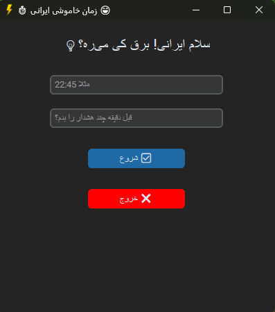

# IranShutdownTimer ⚡⏰

یک برنامه دسکتاپ ساده و شیک به زبان پایتون برای زمان‌بندی خاموشی سیستم ویندوز با هشدار قبلی و آیکن مخفی در نوار وظیفه (System Tray).

---

## ویژگی‌ها

- رابط کاربری مدرن با [customtkinter](https://github.com/TomSchimansky/CustomTkinter)  
- امکان تنظیم ساعت خاموشی و زمان هشدار قبل از آن  
- مخفی شدن خودکار برنامه در System Tray  
- نمایش هشدار با دکمه OK بدون گزینه کنسل  
- خاموش کردن سیستم به حالت Hibernate  
- آیکن ساده و قابل تغییر در System Tray با [pystray](https://github.com/moses-palmer/pystray)  
- کاملاً به زبان فارسی با استایل راست‌چین  

---

## پیش‌نیازها

- Python 3.8 یا بالاتر  
- نصب پکیج‌های زیر:  
```bash
  pip install customtkinter pystray pillow
````

---

## نحوه استفاده

1. پروژه را کلون کنید:

   ```bash
   git clone https://github.com/matinhajiseftjani400/IranShutdownTimer.git
   cd IranShutdownTimer
   ```

2. فایل `shutdown_timer.py` را اجرا کنید:

   ```bash
   python shutdown_timer.py
   ```

3. ساعت خاموشی و مدت زمان هشدار را وارد کنید.

4. دکمه "شروع شمارش" را بزنید تا برنامه مخفی شده و تایمر شروع شود.

5. هنگام رسیدن به زمان هشدار، پیام نمایش داده شده و با زدن OK سیستم به حالت Hibernate می‌رود.

---

## اسکرین‌شات

<p align="center">
  
</p>

---

## ساختار پروژه

```
IranShutdownTimer/
├── shutdown_timer.py     # کد اصلی برنامه
├── README.md             # این فایل راهنما
└── LICENSE              # مجوز (MIT یا هرچی که انتخاب کنی)
```

---

## لایسنس

این پروژه با مجوز MIT منتشر شده است.
برای اطلاعات بیشتر، فایل `LICENSE` را ببینید.

---

## توسعه‌دهنده
## *Matin*
[Website](https://matin-technology.ir/)
[GitHub](https://github.com/matinhajiseftjani400)
[E-mail](mailto:matin@hajiseftjani.ir)
---

## تشکر ویژه

از [CustomTkinter](https://github.com/TomSchimansky/CustomTkinter) و [pystray](https://github.com/moses-palmer/pystray) برای ابزارهای فوق‌العاده‌شان سپاسگزارم.
و همچنین همه ایرانی‌های دوست‌داشتنی که همیشه پشت سر هم هستند! 🇮🇷💙

---
👨‍💻  Developed By [Matin](http://matin-technology.ir/) For Iranians💙
---
